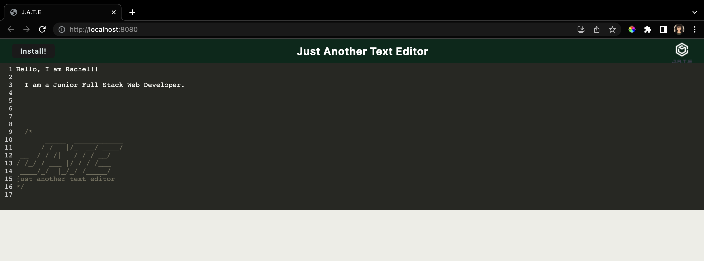

# Just Another Text Editor


## Table of Contents

- [Description](./README.md#description)
- [Installation](./README.md#installation)
- [Usage](./README.md#usage)
- [Screenshots](./README.md#screenshots)
- [License](./README.md#license)
- [Author](./README.md#author)
- [Links](./README.md#links)
- [Questions](./README.md#questions)

## Description

JATE or Just Another Text Editor is a text editor that runs in the browser. It is a single page application that meets PWA criteria. It is also functional offine.

## Installation

Application requires installation of `babel`, `css-loader`, `html-webpack-plugin`, `code-mirror-themes` `http-server`, `style-loader`, `webpack`, `idb`, `if-env`, and `express`.

Open root terminal

```
$npm install
```

## Usage

Open root terminal

```
$npm run start
```

## Screenshots

### Running on localhost:3000



### Offline and Downloaded


## License

This application is covered under MIT License.

## Author

Rachel Haddad

## Links

- Here is the repo: [Repo](https://github.com/buttercupsmom/text-editor)
- Here is the deployed page: [Heroku](https://vast-headland-48370.herokuapp.com/)

## Questions

If you have any further questions or comments:

- Direct message me on [GitHub](https://github.com/buttercupsmom)
- Email me: [yarkony.rachel@gmail.com](mailto:yarkony.rachel@gmail.com)
